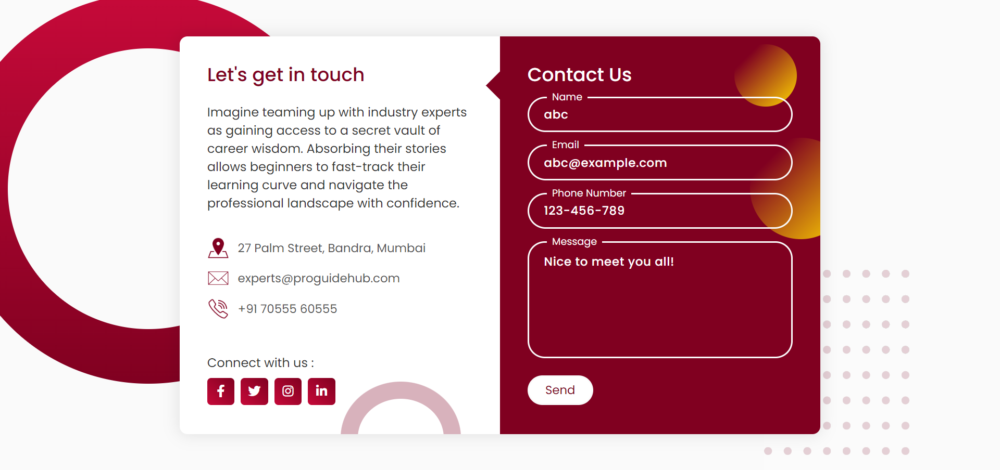

# Contact Form Design

A web design that allows users to get in touch with team through a contact form. This project provides a user-friendly interface for submitting messages and provides contact information for users to connect.

## Table of Contents

- [Description](#description)
- [Installation](#installation)
- [Screenshots](#screenshots)
- [Usage](#usage)
- [Features](#features)
- [License](#license)
- [Acknowledgments](#acknowledgments)

## Description

The Contact Form is designed to facilitate user communication with expert team. It offers a clean and modern interface for users to fill out a contact form and send messages with their inquiries. Additionally, the application provides contact information and links to social media profiles.

## Installation

To run this project locally, follow these steps:

1. Clone the repository: `git clone https://github.com/pradeep-innovates/contact-form-design.git`
2. Navigate to the project directory: `cd contact_form_design`
3. Open the `index.html` file in a web browser.

## Screenshots

## Usage

1. Access the Contact Form Web Design through a web browser.
2. Fill in your name, email, phone number, and message in the provided input fields.
3. Click the "Send" button to submit your inquiry.
4. You can also find the contact information and social media links on the page.

## Features

- Responsive and visually appealing design.
- Interactive input fields with animations.
- Contact form with fields for name, email, phone number, and message.
- Social media links to connect with your team.
- Provides contact information for reaching out.

## License

This project is licensed under the [MIT License](LICENSE).

## Acknowledgments

- This project was inspired by the need for a modern and user-friendly contact form for websites.
- Special thanks to the FontAwesome library for providing the icons used in this project.

